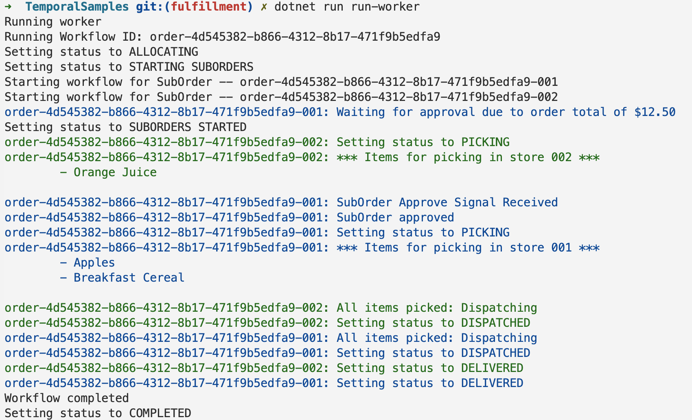

# dotnet boilerplate



### New Project initialization (don't need to run these as they're already in this project)
```
dotnet add package Temporalio --prerelease
dotnet add package Microsoft.Extensions.Logging --version 7.0.0
dotnet add package Microsoft.Extensions.Logging.Console --version 7.0.0
dotnet add package Microsoft.VisualStudio.Threading.Analyzers --version 17.4.33
dotnet add package System.CommandLine --prerelease
dotnet add package Newtonsoft.Json
```

### Run

The sample is configured by default to connect to a local Temporal Server running on localhost:7233.

To instead connect to Temporal Cloud, set the following environment variables, replacing them with your own Temporal Cloud credentials:

```
TEMPORAL_ADDRESS=testnamespace.sdvdw.tmprl.cloud:7233
TEMPORAL_NAMESPACE=testnamespace.sdvdw
TEMPORAL_CERT_PATH="/path/to/file.pem"
TEMPORAL_KEY_PATH="/path/to/file.key"
```

Run workflows from
```
cd TemporalSamples
```

First, we have to run a worker. In a separate terminal, run the worker from this directory:
```
dotnet run run-worker
```
This will start a worker. To run against Temporal Cloud, `--target-host` may be something like
`my-namespace.a1b2c.tmprl.cloud:7233` and `--namespace` may be something like `my-namespace.a1b2c`.

With that running, in a separate terminal execute the workflow from this directory:
```
dotnet run execute-workflow
```

Get the suborder's workflow ID and signal it to prematurely fail the workflow
```
dotnet run signal-suborder-approve --workflow-id order-9ad64b2d-0920-434d-8f78-e994805a50dd-001
# or to deny
dotnet run signal-suborder-deny --workflow-id order-9ad64b2d-0920-434d-8f78-e994805a50dd-001
```